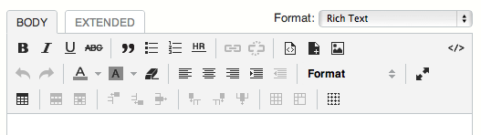
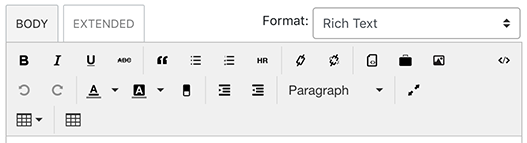

# Table Feature For TinyMCE

Load the table plugin and add buttons for table function to TinyMCE that is default rich text editor of Movable Type 5.2 or later.

* MT6-

* MT7

## Requirements

* Movable Type 5.2 or later

## Installation

1. Unpack the `TableFeatureForTinyMCE` archive.
2. Upload the contents to the MT `plugins` directory.

Should look like this when installed:

    $MT_HOME/
        plugins/
            TableFeatureForTinyMCE/
        mt-static/
            plugins/
                TableFeatureForTinyMCE/

## License

This library is free software released under the MIT. Please see LICENSE.txt

## Copyright

The following copyright notice applies to all the files provided in this
distribution, including binary files, unless explicitly noted otherwise.

Copyright 2012 Six Apart, Ltd.
